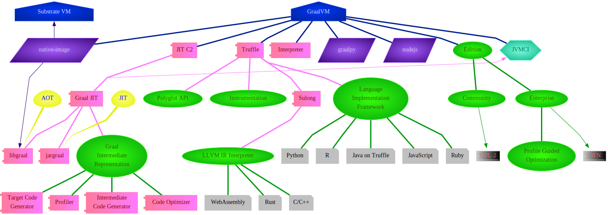
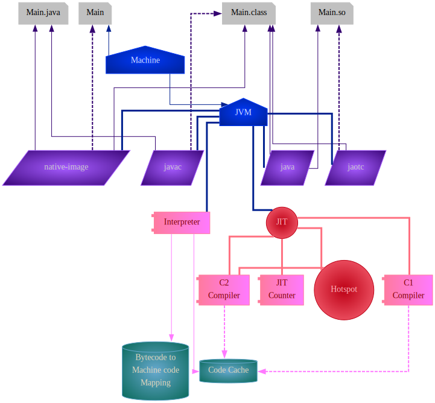
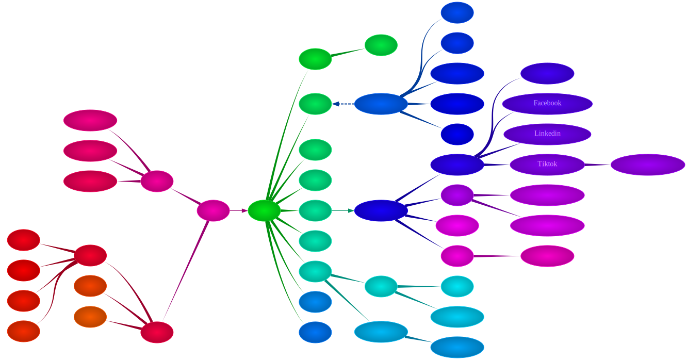
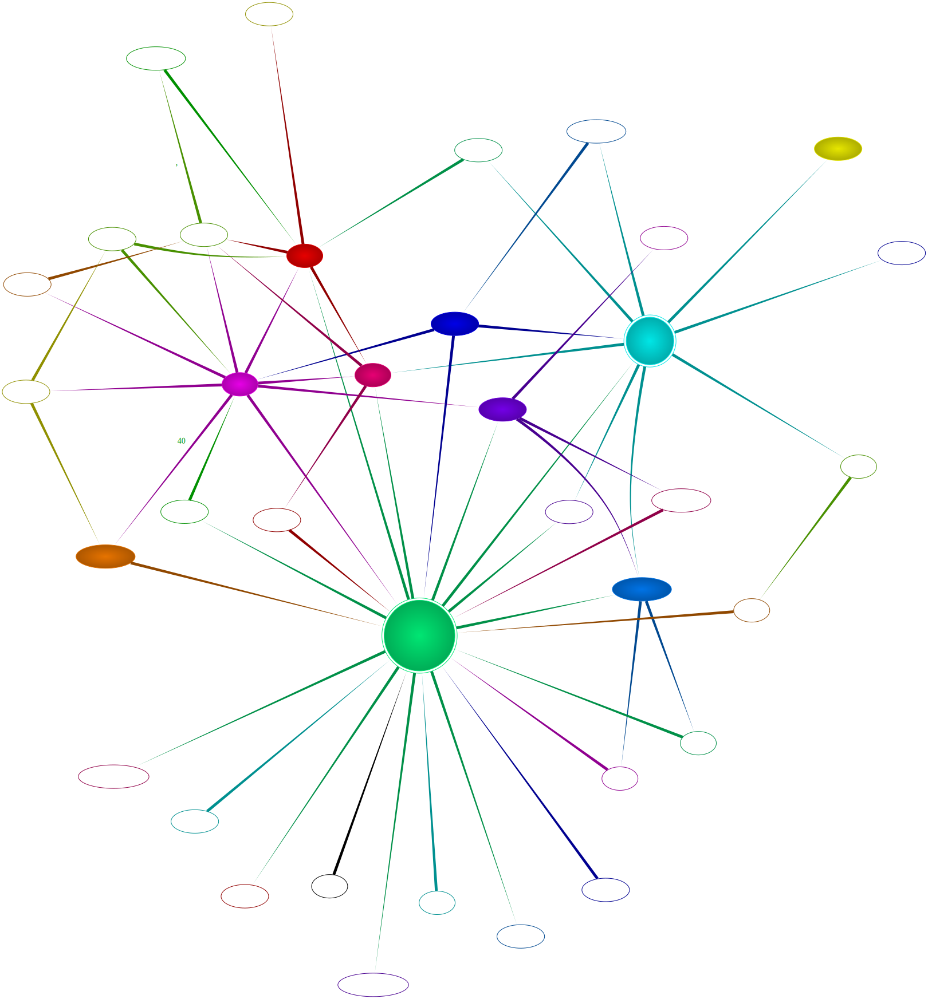
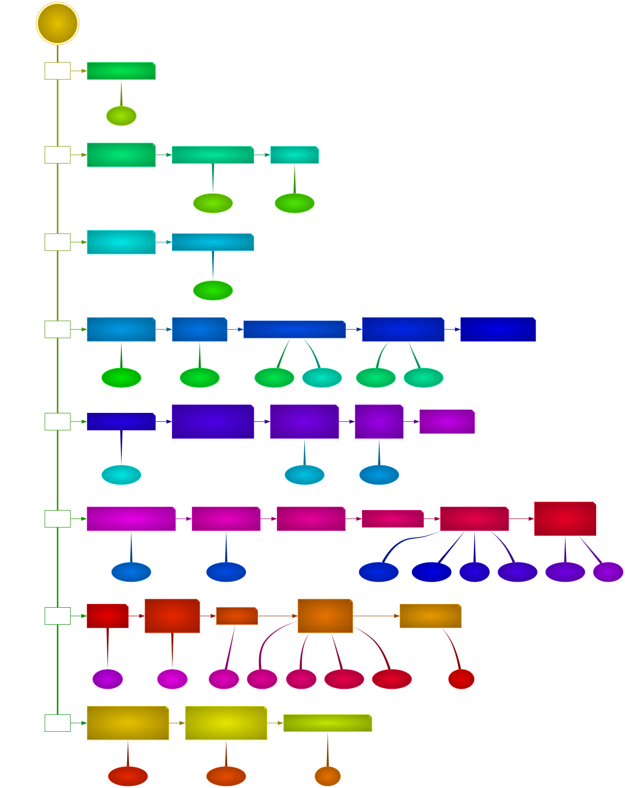

# Lsgv Illustration

Lsgv my knowledge.

### Usage

1. [Lsgv](https://github.com/chongwish/lsgv)
2. `git clone https://github.com/chongwish/lsgv-illustration`
3. `lsgv java/graalvm-architecture.lsgv > java/graalvm-architecture.png`

Optiaonal:

1. [Bashert](https://github.com/chongwish/bashert)
2. `lsgv-dir . ` or `listen -f . lsgv-dir . `

### For Example

#### GraalVM Architecture

#### Run Java Code

#### Operation of Toy Company at Chenghai 

####  Character Relationship in a Novel

#### Event in a Novel

